<div align="center">


# SkillBridge Vietnam

**Work becomes proof. Proof opens opportunities.**

[Tiếng Việt](README.vi.md) · **English**

[Open the demo](https://404-eight-rho.vercel.app/) · [Independent wallet verifier](https://404-eight-rho.vercel.app/claim-verifier/index.html) · [Judge walkthrough](docs/judging/README.md) · [Architecture](docs/architecture/README.md) · [Demo reliability / Nghiệm thu](docs/testing/demo-reliability-acceptance.md)

[](https://github.com/2274802010922/SkillBridge-Vietnam/actions/workflows/ci.yml)

> Reliability release (21 September): explicit reviewer/deadline guidance, verified reward progress, recoverable issuer setup and milestone replay protection. Local build + 184 regression tests pass; live wallet/provider acceptance is tracked in the [runbook](docs/testing/demo-reliability-acceptance.md).


</div>

> **Demo scope:** Solana Devnet · AI is optional · a human makes the official decision · VND cashout is sandbox-only.

SkillBridge turns a real student or freelancer submission into evidence that can be reviewed by a person, committed to a verifiable credential, and reused when the owner applies to a second opportunity.

The core promise is simple: **a business funds a challenge, a participant submits a fixed version, a reviewer owns the decision, and the participant can carry the resulting proof to another organization.**

## Product in one minute

| User | Problem | What SkillBridge gives them |
| --- | --- | --- |
| Student / freelancer | Good work is trapped in files and hard to compare fairly | A private evidence record, human-approved result, Skill Passport and independent claim path |
| Business | Applications contain claims with little comparable proof | Funded challenges, shared rubrics, visible fund evidence and credential-gated opportunities |
| University / reviewer | Assessment work is difficult to reuse and audit | Evidence reader, optional AI draft, manual scoring, provenance and revocable credentials |

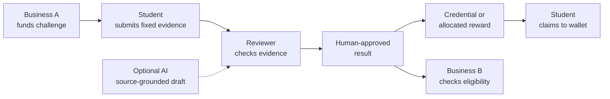

**For students:** know the next step, inspect official feedback, claim rewards and apply with a credential. **For organizations:** fund work, evaluate evidence and select candidates with a clear verification history.

## UI showcase

These screenshots come from the current local build. Workflow screenshots use explicitly labelled QA fixtures; they demonstrate interface behavior and permission boundaries, not customer traction or revenue.

| Public entry | Wallet connection |
| --- | --- |
| 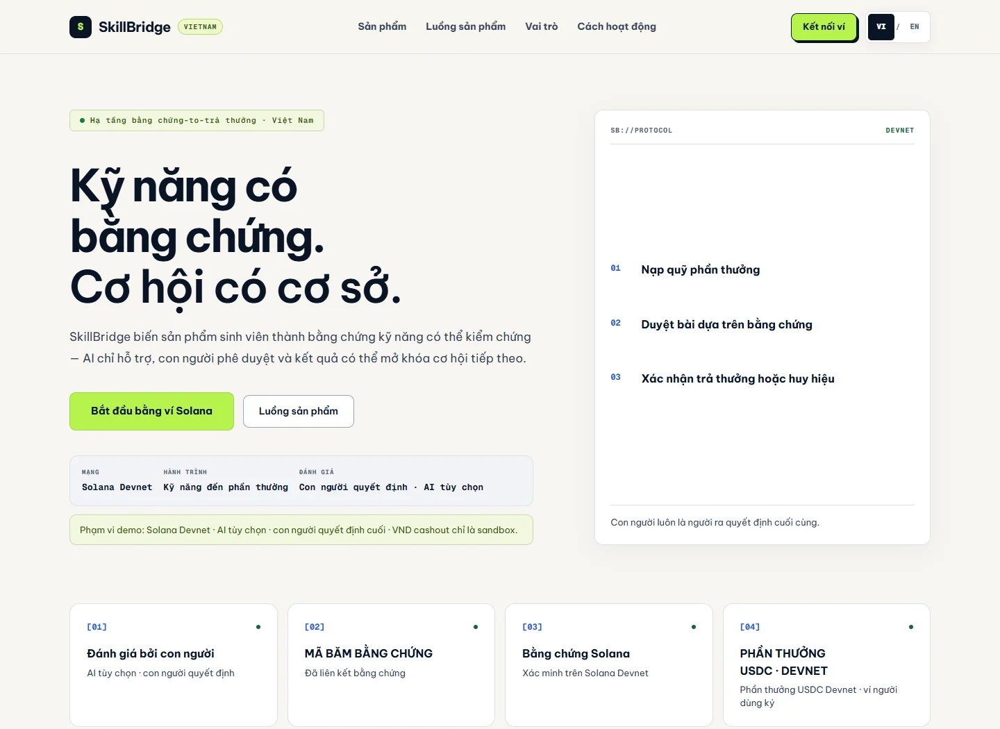 | 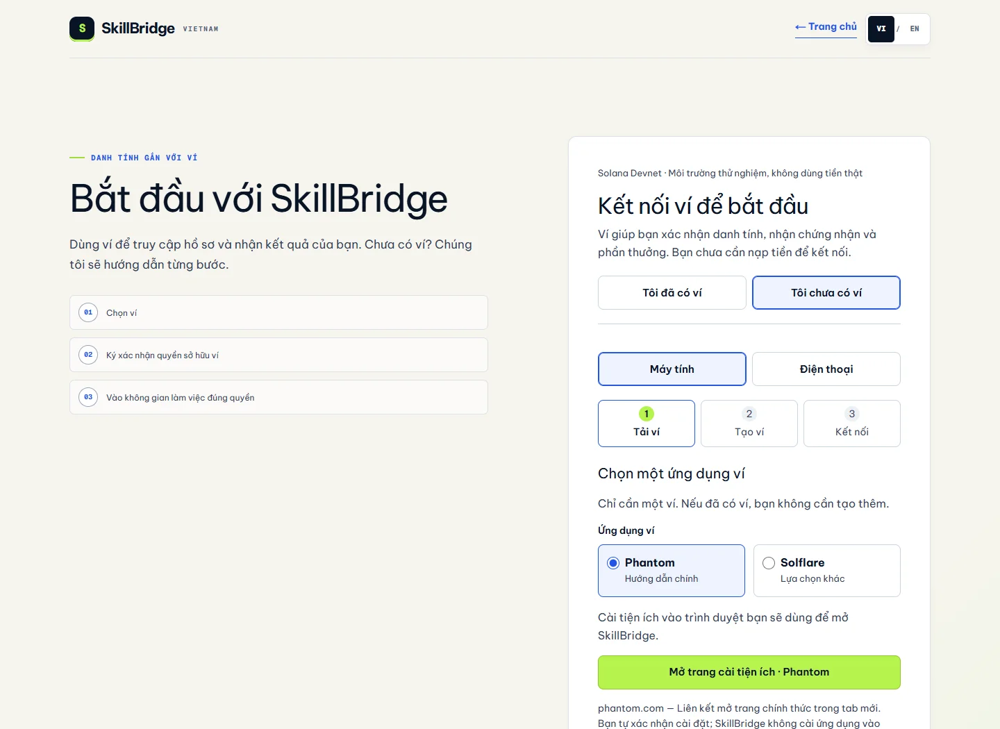 |
| Understand the product thesis and demo scope. | Connect a Solana wallet; no funds are required to start. |

| Challenge brief | Student submission |
| --- | --- |
| 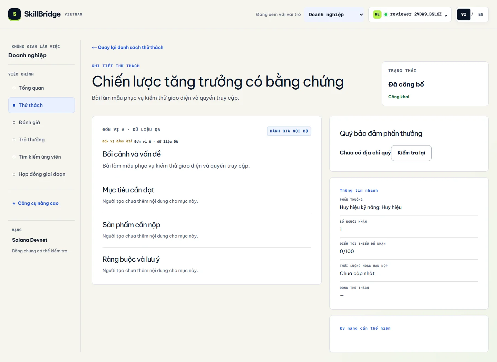 | 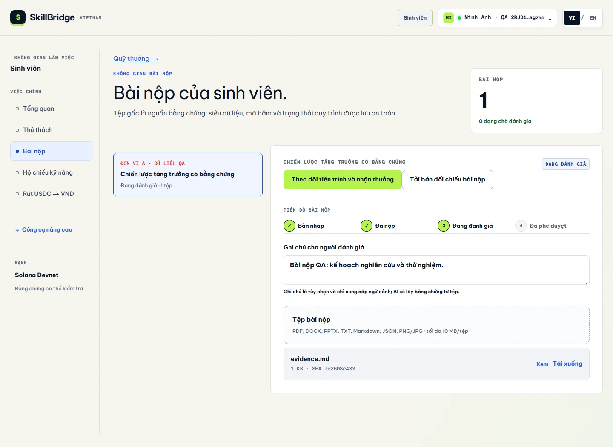 |
| Read the brief, rubric, reward type and fund evidence. | Submit files, notes and a fixed evidence version. |

| Human review | Skill Passport |
| --- | --- |
| 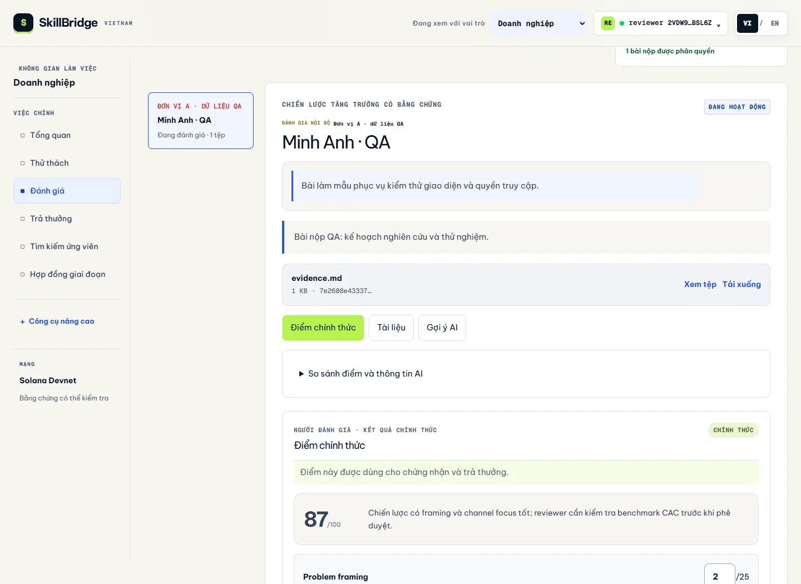 | 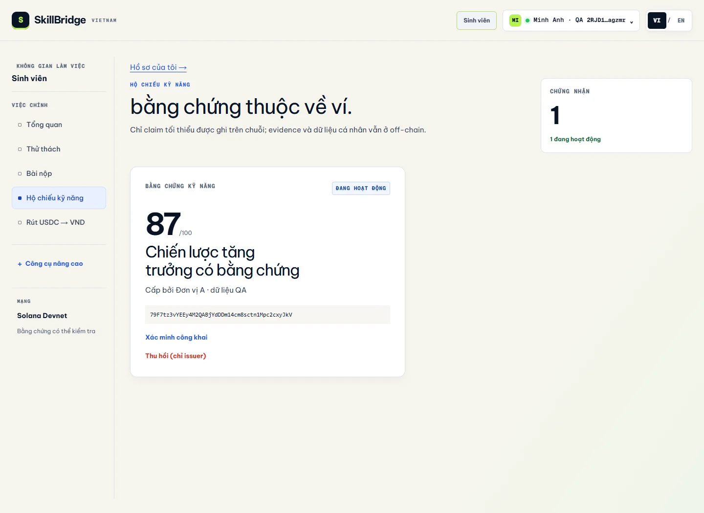 |
| AI can suggest; the reviewer edits and owns the official score. | Inspect an active, revocable credential linked to a wallet. |


The evidence reader uses explicitly labelled QA data and shows how a reviewer opens the source behind a citation.

| Student portfolio | Employer comparison |
| --- | --- |
| 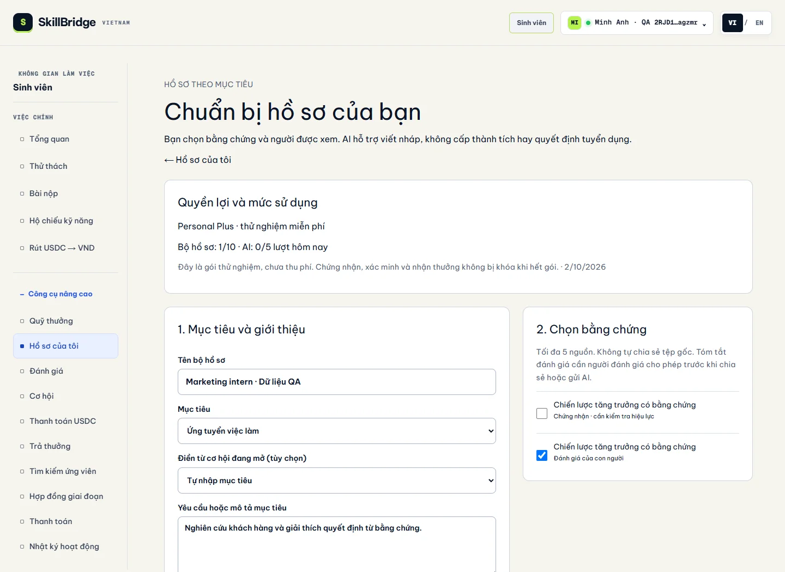 | 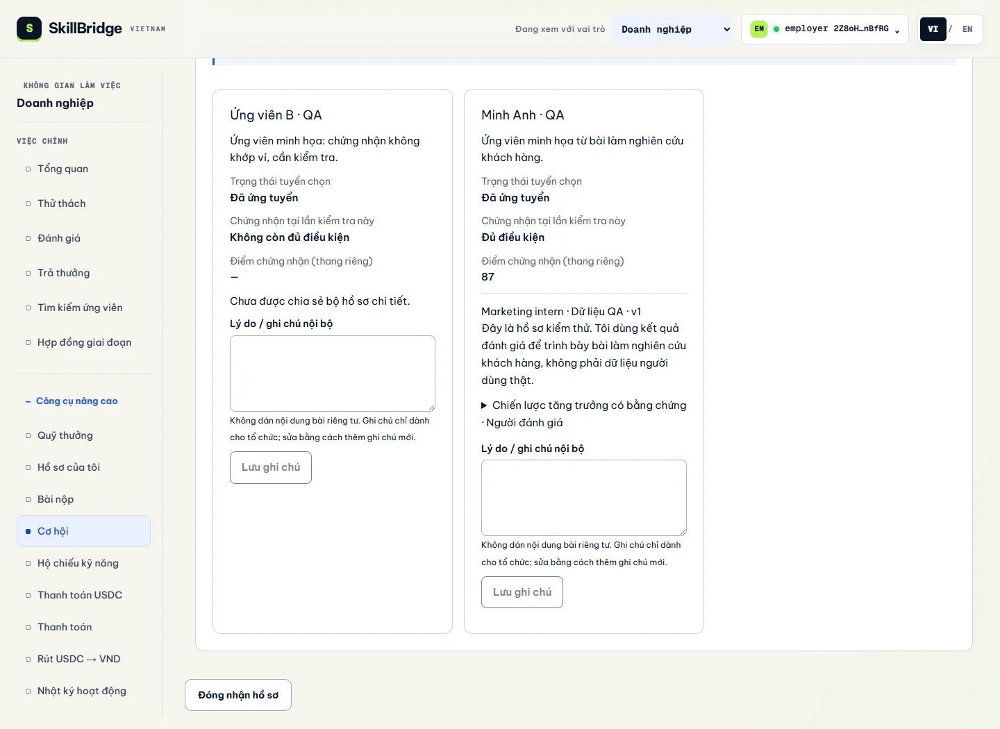 |
| Select evidence and publish a purpose-specific version. | Compare permitted applicant evidence and keep private notes. |

| Devnet cashout sandbox |
| --- |
| 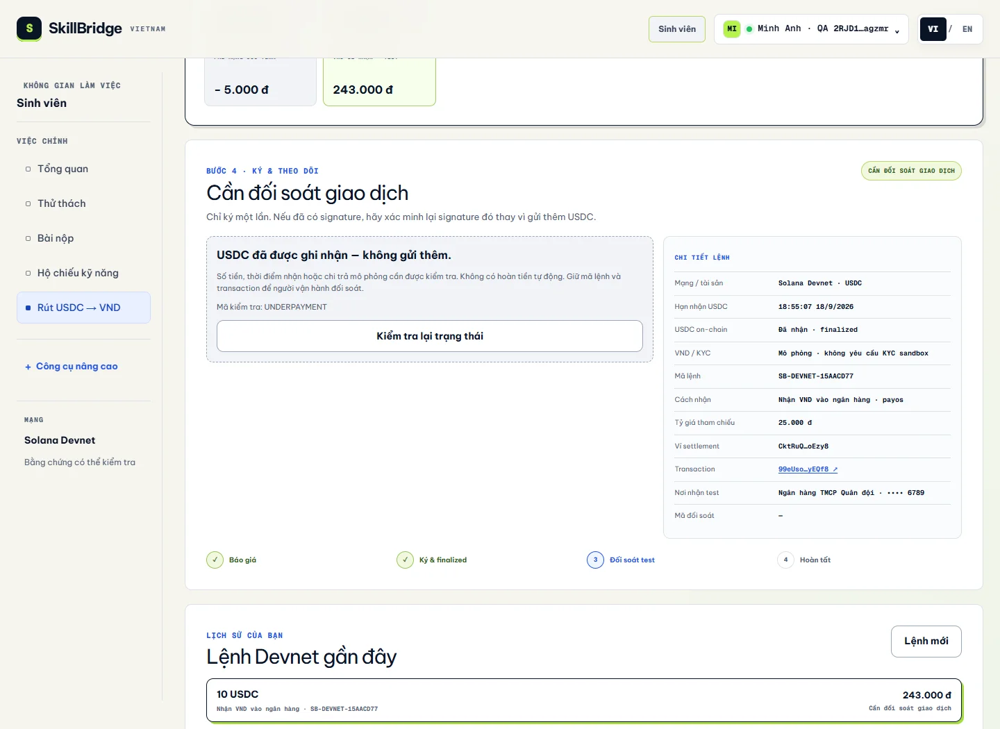 |
| USDC Devnet verification is real; the VND receipt is explicitly simulated. |

## What makes the blockchain necessary

Solana is used for facts that should remain independently checkable: custody, accepted roles, reward allocation, recipient binding, replay protection, credential status and access receipts. Private files, notes and personal data stay off-chain.

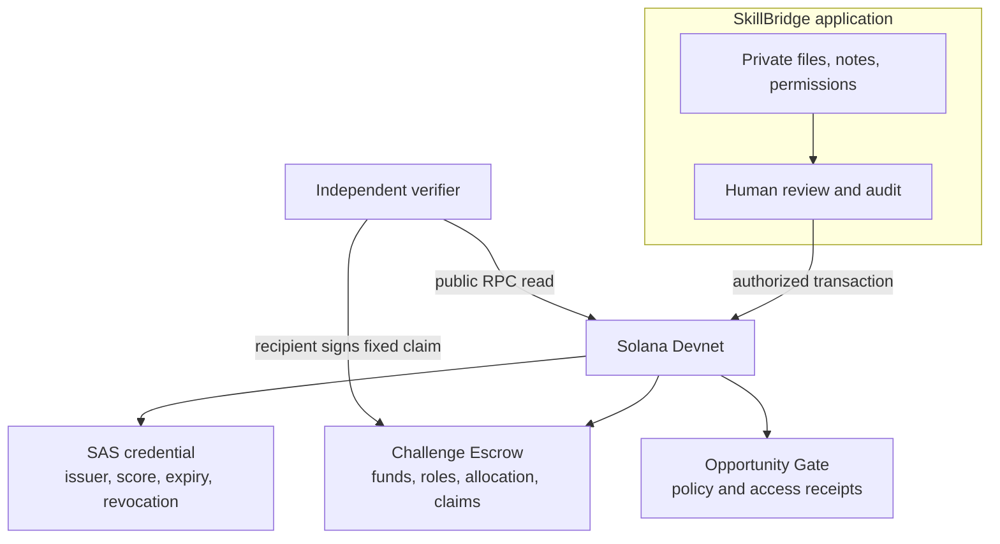

The smart contracts do not prove that a human score is fair or that an issuer is trustworthy. They make committed ownership and state transitions inspectable; the verifier still applies its own issuer, wallet, score and freshness policy.

## AI supports the review; people decide

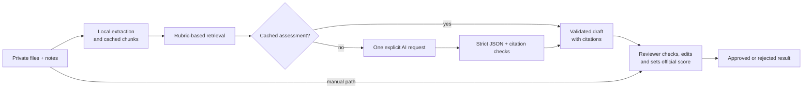

The assessment route extracts documents locally, retrieves rubric-relevant evidence, caches chunks and results by hash, and makes one generation request per submission version. AI cannot approve, allocate rewards, issue credentials or sign transactions. Manual review remains available when AI is unavailable.

## Claim without the application API

An allocated reward can be checked and claimed through the standalone verifier. It reads current Devnet state through public RPC, checks recipient and allocation, then asks the recipient wallet to sign the fixed claim.

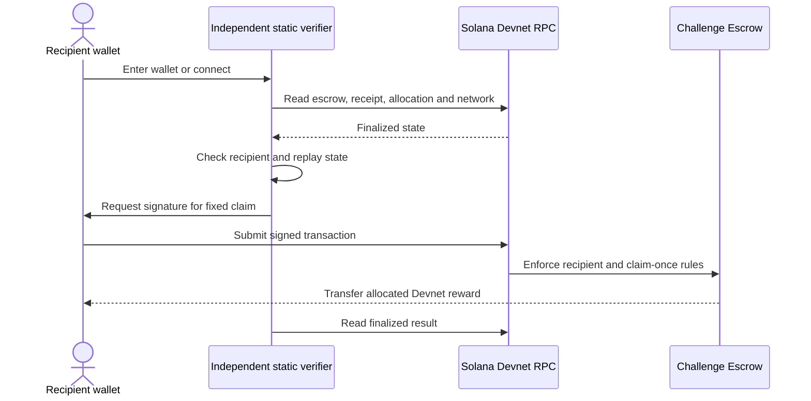

## Evidence portfolio and employer workflow

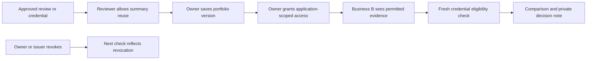

The owner chooses what to share. Raw submission files and private reviewer notes are not implicitly exposed to an employer. Rechecking a credential is separate from the historical decision made when an application was submitted.

## Off-ramp sandbox boundary

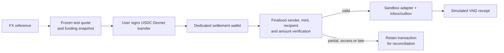

The cashout experiment is separate from challenge escrow. New orders require a dedicated public Devnet settlement wallet, use immutable snapshots and preserve uncertain deposits. No bank transfer or real VND payout is claimed.

## Business model hypothesis

The first wedge is a Vietnam pilot with a university, club or employer running a small number of evidence-based challenges. Potential paid value is operational: challenge setup, reviewer workflow, credential issuance, employer verification and portfolio access. The repository demonstrates the product and usage limits; it does not claim paying customers or revenue.

## Verifiable evidence

| Claim | Evidence |
| --- | --- |
| Allocated reward can be claimed without the SkillBridge API | [Independent claim proof](docs/solana/evidence/independent-claim-proof.json) |
| Recipient can start with zero SOL | [Sponsored claim proof](docs/solana/evidence/sponsored-claim-proof.json) |
| Revocation changes fresh eligibility | [Opportunity proof](docs/solana/evidence/opportunity-application-proof.json) |
| Review, portfolio and employer permissions | [Competition flow tests](tests/integration/competition-flow.test.ts) and [portfolio flow tests](tests/integration/portfolio-flow.test.ts) |
| Credential issuance survives DB/RPC uncertainty | [Issuance fault tests](tests/backend/credential-issuance.test.ts) |
| Cashout recovery and webhook replay protection | [Off-ramp tests](tests/backend/offramp.test.ts) and [setup guide](docs/testing/offramp.md) |

The current standard suite passes **168 tests** locally. Live Devnet and live OpenRouter checks are separate owner-run acceptance steps. This project makes no mainnet-readiness or security-audit claim.

## Demo path

1. Open the demo and connect a Devnet wallet.
2. Use the business role to open the funded challenge and show the visible fund state.
3. Switch to the student role, submit the labelled evidence file and open progress.
4. Switch to the reviewer role. Show the evidence reader, optional AI suggestion and official manual score.
5. Show the Skill Passport and public verification link.
6. Use the independent verifier to explain how an allocated claim can exit the application API.
7. Finish with the employer comparison view and the Devnet/sandbox scope note.

For a judge checklist, use [docs/judging/README.md](docs/judging/README.md). For a role-by-role test, use [docs/testing/manual-test-guide.md](docs/testing/manual-test-guide.md).

## Run and deploy

Requires Node.js **22.13+** and npm.

```bash
npm ci
npm run dev
```

Create `.env.local` from [.env.example](.env.example). Local development uses SQLite when Turso is not configured.

```bash
npm run check:repo
npm run lint
npm test
```

Deploy one Next.js project on Vercel from the repository root. Follow [Vercel setup](docs/deployment/vercel.md), [OpenRouter setup](docs/deployment/openrouter.md) and [off-ramp sandbox setup](docs/testing/offramp.md). Never commit `.env.local`, wallet keypairs or provider secrets.

## Repository map

```text
app/            Thin Next.js route and layout adapters
frontend/       React screens, components, bilingual copy and styles
backend/        HTTP handlers, auth, AI, database, storage and services
solana/         Anchor programs, IDL, chain clients and server verification
shared/         Pure validation and data contracts
tools/          Independently hostable wallet verifier
tests/          Unit, HTTP integration, browser fixtures and opt-in Devnet tests
docs/           Product, architecture, evidence, deployment and harness guides
public/         Public product assets
```

[Frontend](frontend/README.md) · [Backend](backend/README.md) · [Solana](solana/README.md) · [Architecture](docs/architecture/README.md) · [All documentation](docs/README.md) · [Changelog](CHANGELOG.md)

Invoices and VND cashout are supporting experiments; the VND settlement leg remains sandbox. The repository does not currently grant an open-source license.
