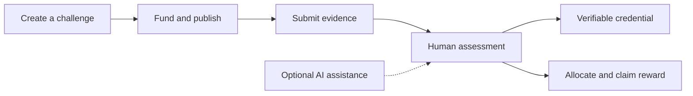

<div align="center">
  

# SkillBridge Vietnam

### Proven skills. Verifiable rewards.

A Vietnam-first platform connecting students, businesses and reviewing organizations through real work, human assessment and Solana Devnet evidence.

[Tiếng Việt](README.vi.md) · **English**

[Open the app](https://404-eight-rho.vercel.app/) · [Judge's walkthrough](docs/judging/README.md) · [Architecture](docs/architecture/README.md) · [Devnet evidence](docs/solana/README.md)

[](https://github.com/2274802010922/404/actions/workflows/ci.yml)


</div>

---


<details>
<summary>More product screens</summary>

**Wallet sign-in** — Wallet Standard discovery in a browser without an extension.


**Manual assessment** — a local QA fixture, not a claim about real users or traction.


</details>

## Why SkillBridge?

Students need a way to show what they can do. Businesses need evidence beyond a CV.
Reviewing organizations need a clear process for assessing work and issuing credentials.

SkillBridge connects that process: a business defines a challenge, students submit files,
humans assess the work, and verifiable credentials or funded rewards make the result useful.

## The product journey



- **For students:** discover challenges, submit work, build a wallet profile and share verified achievements.
- **For businesses:** publish challenges, secure reward budgets, review submissions and find candidates.
- **For reviewing organizations:** score manually or use evidence-linked AI suggestions; humans own the official decision.
- **For verifiers:** inspect credential status and transaction evidence through public verification pages.

## What is implemented?

| Area | Current scope |
| --- | --- |
| Wallet identity | Sign In With Solana, server-enforced permissions, individual wallet profiles |
| Challenges | Public/invitation-only access, editable drafts, structured briefs and file submissions |
| Assessment | Independent manual scoring; optional AI with document extraction, retrieval and caching |
| Credentials | Issuance, revocation and verification on Solana Devnet |
| Monetary challenge rewards | Program-controlled escrow for new monetary challenges; human decisions, fixed-recipient claims |
| Existing rewards / badge bonds | Separate legacy reward-vault path; existing records retain their original rules |
| USDC invoices | Devnet wallet transfer, signature verification and reconciliation |
| USDC → VND | Devnet transfer plus **sandbox** VND settlement; no claim of real bank payout |

See the [escrow runbook](docs/solana/escrow-runbook.md) for constraints, deadlines,
backup reviewers, upgrade authority and the distinction between new and legacy funds.

## Explore the code

```text
frontend/     Product screens, shared UI, language and styles
backend/      HTTP handlers, authentication, AI, storage and database
solana/       Anchor programs, IDL, chain clients and server integrations
shared/       Pure validation and data shared across layers
app/          Thin Next.js route and layout entry points
tests/        Backend, Solana and integration checks
docs/         Product, architecture, deployment and judging guides
public/       Public product assets
tooling/      Archived agent guidance and optional legacy Sites tools
```

**Start here:** [Frontend](frontend/README.md) · [Backend](backend/README.md) ·
[Solana](solana/README.md) · [Shared code](shared/README.md) · [Tests](tests/README.md)

Next.js serves both the UI and backend on one Vercel project. Folder separation does
not introduce a second deployment or change existing URLs.

## Run locally

Requires **Node.js 22.13+** and npm. Run commands from the repository root.

```bash
npm ci
```

Copy `.env.example` to `.env.local`, configure the features you want to test, then:

```bash
npm run dev
```

Open [localhost:3000](http://localhost:3000). Without Turso settings, development uses
local SQLite. AI, private file storage and blockchain actions need their corresponding
configuration; see [deployment and environment setup](docs/deployment/vercel.md).

## Verify changes

```bash
npm run check:repo
npm run lint
npm test
```

The default suite builds the app and runs regression checks. Live Devnet and local
validator scripts are separate: [testing guide](docs/testing/README.md).

## Documentation

| You want to… | Start here |
| --- | --- |
| Evaluate the competition entry | [Judge's walkthrough](docs/judging/README.md) |
| Understand the architecture | [Architecture](docs/architecture/README.md) |
| Deploy to Vercel | [Deployment guide](docs/deployment/vercel.md) |
| Test each role | [Manual testing](docs/testing/manual-test-guide.md) |
| Inspect blockchain proof | [Solana evidence](docs/solana/README.md) |
| Understand the interface | [Design system](docs/design/system.md) |
| Contribute a change | [Contributing](CONTRIBUTING.md) |
| Review notable changes | [Changelog](CHANGELOG.md) |

[All documentation →](docs/README.md)

## Project status and source use

Built as a UniHackFest project. The target network is Solana **Devnet**.
The repository does not currently grant an open-source license. Third-party brand
assets retain their respective ownership; see [asset attribution](public/brands/README.md).
