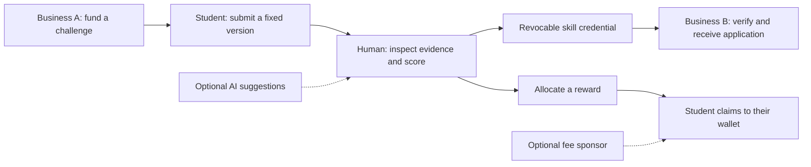

<div align="center">


# SkillBridge Vietnam

**Work becomes proof. Proof opens opportunities.**

[Tiếng Việt](README.vi.md) · **English**

[Try SkillBridge](https://404-eight-rho.vercel.app/) · [Wallet lookup](https://404-eight-rho.vercel.app/claim-verifier/index.html) · [Judge's walkthrough](docs/judging/README.md) · [Architecture](docs/architecture/README.md)

[](https://github.com/2274802010922/SkillBridge-Vietnam/actions/workflows/ci.yml)


</div>

SkillBridge connects students, independent professionals, businesses and reviewing organizations through real work:
a business funds a challenge, a human reviews the submission, and the student receives
verifiable skill credentials and allocated rewards. Another business can accept that
credential when the student applies for an opportunity.

Built for **UniHackFest**, with Vietnamese/English interfaces and a Solana Devnet
implementation. Live chain evidence, automated QA and pending manual checks are identified
separately below.

## Follow one student's journey



**For students:** know the next step, inspect official feedback, claim rewards and apply
with a credential. **For organizations:** fund work, evaluate evidence and select candidates
with a clear verification history.

## Evidence you can use, not just badges you can collect

Students and freelancers can create **purpose-specific evidence portfolios** from
their own reviewed work and credentials. Owners choose the saved version and audience;
private submission files are never implicitly shared with an employer.

- **For people seeking work:** write a portfolio manually or request a cited OpenRouter
  draft, inspect its sources, and approve the introduction yourself.
- **For employers:** compare up to three applicants, inspect permitted evidence,
  recheck credential validity and record private decision notes. Different rubrics
  are not silently combined into an overall ranking.
- **For reliability:** issuance reserves capacity and journals the signed transaction
  before broadcast, recovering finalized chain success after a database interruption.
- **For the business-model demo:** server-issued launch trials show actual limits and
  usage. They are not paid subscriptions or evidence of revenue; core verification
  and allocated reward claims are never paywalled.

[Acceptance and recovery guide](docs/testing/evidence-portfolios.md) ·
[Portfolio HTTP tests](tests/integration/portfolio-flow.test.ts) ·
[Issuance fault tests](tests/backend/credential-issuance.test.ts)

## What makes it useful

| Capability | What users can actually do |
| --- | --- |
| Funded challenges | Publish public or invitation-only challenges with structured briefs, escrow and visible fund proofs |
| Evidence-linked review | Open an AI citation in the authorized source, inspect extracted text and PDF pages, then set the official human score |
| Progress tracking | Follow submission, human assessment, allocation, claim and credential status in one place |
| Credential-based applications | Business B accepts an issuer and score threshold; students preview and submit only the information they choose to share |
| Fresh credential checks | Recheck a credential when reviewing an applicant; historical eligibility is distinct from current validity |
| Sponsored claims | Recipient signs while a configured sponsor pays Devnet network fees, with fixed-message validation and budget limits |
| Independent verification | Look up a wallet and claim an allocated reward through a separately hostable static tool |

Manual review is independent of AI. AI cannot approve work, allocate funds or sign a payout.

<details>
<summary><strong>Product screens</strong></summary>

**Landing page**


**Open a citation and inspect the matching text**


The evidence-reader image uses labeled local QA data, not real user research or customer traction.

**Wallet sign-in and manual review**


</details>

## Check the evidence

| Claim | Evidence and scope |
| --- | --- |
| Allocated reward can be claimed without the SkillBridge API | [Independent claim proof](docs/solana/evidence/independent-claim-proof.json): recipient-only SOL Devnet claim |
| Recipient can start with zero SOL | [Sponsored claim proof](docs/solana/evidence/sponsored-claim-proof.json): 0 → 0.001 SOL; a separate sponsor paid the 10,000-lamport fee |
| Revocation changes fresh eligibility | [Opportunity proof](docs/solana/evidence/opportunity-application-proof.json): accepted before revocation, denied afterward |
| Review → application workflow and access controls | [HTTP integration test](tests/integration/competition-flow.test.ts), using an isolated database and explicit RPC fixtures |
| Changed claim message is rejected | [Co-signing tests](tests/solana/sponsored-claim.test.ts) |
| Duplicate application requests do not duplicate records | [Application tests](tests/backend/applications.test.ts) |

The current default suite passed **151 tests** locally at this release checkpoint.
CI runs the build, repository checks, lint and automated suite. Live Devnet tests are
opt-in and spend test SOL.

**Pending manual validation:** the owner will test the live OpenRouter provider after
deployment. SOL sponsorship has live evidence; USDC sponsorship has instruction-level
coverage and still needs a funded live USDC test. No mainnet-readiness or security-audit
claim is made.

## Why Solana matters

- **Escrow:** the program holds funds and enforces accepted roles, allocation, fixed
  recipients and protection against repeated claims.
- **Credentials:** SAS records can be read outside the application and checked for
  issuer authorization, expiry, schema state and revocation.
- **Opportunity policies:** the program stores policies and verifier-authorized historical
  access receipts. The verifier service performs fresh SAS checks before an application;
  the current gate does not itself parse SAS inside the program.
- **Exit path:** an already allocated reward can be claimed through the independent tool,
  using a public RPC and a compatible wallet.

Private documents and application profiles stay off-chain. Program upgrade authority
still exists. If both reviewers fail to act, unresolved funds remain pending under the
agreed policy. See the [product contract](docs/product/proof-to-payout.md) and
[escrow runbook](docs/solana/escrow-runbook.md).

## Run locally

Requires **Node.js 22.13+** and npm. Run from the repository root:

```bash
npm ci
npm run dev
```

Create `.env.local` from [.env.example](.env.example) before testing integrations.
Local development uses SQLite when Turso is not configured.

For the independently hosted verifier:

```bash
npm run preview:verifier
```

Open [localhost:3000](http://localhost:3000) for the product or
[localhost:3219](http://localhost:3219) for the standalone verifier.

## Deploy and verify

Deploy one Next.js project on **Vercel**, with the repository root as Root Directory.
Use `npm ci` and `npm run build`. Existing records migrate without a database reset;
these upgrades do not require a new Solana program deployment.

- [Vercel configuration](docs/deployment/vercel.md)
- [OpenRouter configuration](docs/deployment/openrouter.md)
- [Applications, progress, citations and sponsored-fee setup](docs/testing/competition-upgrades.md)
- [Independent tool instructions](docs/solana/independent-verifier.md)

```bash
npm run check:repo
npm run lint
npm test
```

For opt-in chain tests and expected results, see the [testing guide](docs/testing/README.md).
Never commit `.env.local`, private keypairs or wallet secrets.

## Repository map

```text
frontend/       Screens, components, bilingual copy and styles
backend/        HTTP handlers, authorization, AI, database and storage
solana/         Anchor programs, IDL, chain clients and server signing
shared/         Shared validation and data contracts
app/            Thin Next.js route/layout adapters
tools/          Independently hostable wallet verifier
tests/          Unit, HTTP integration and opt-in Devnet tests
docs/           Product, architecture, evidence and deployment guides
public/         Public product assets
tooling/        Archived guidance and optional legacy tools
```

[Frontend](frontend/README.md) · [Backend](backend/README.md) · [Solana](solana/README.md) ·
[Contributing](CONTRIBUTING.md) · [Changelog](CHANGELOG.md) · [All documentation](docs/README.md)

## Scope and source use

Invoices and VND cashout are supporting experiments; the VND settlement leg remains
**sandbox**. They are separate from the challenge-to-opportunity flow.

This repository does not currently grant an open-source license.
Third-party brand assets retain their respective ownership; see
[asset attribution](public/brands/README.md).
