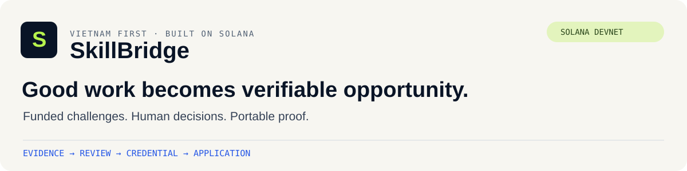
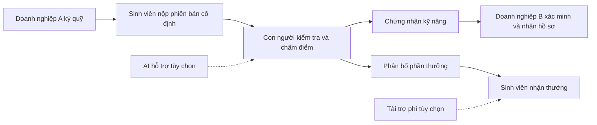
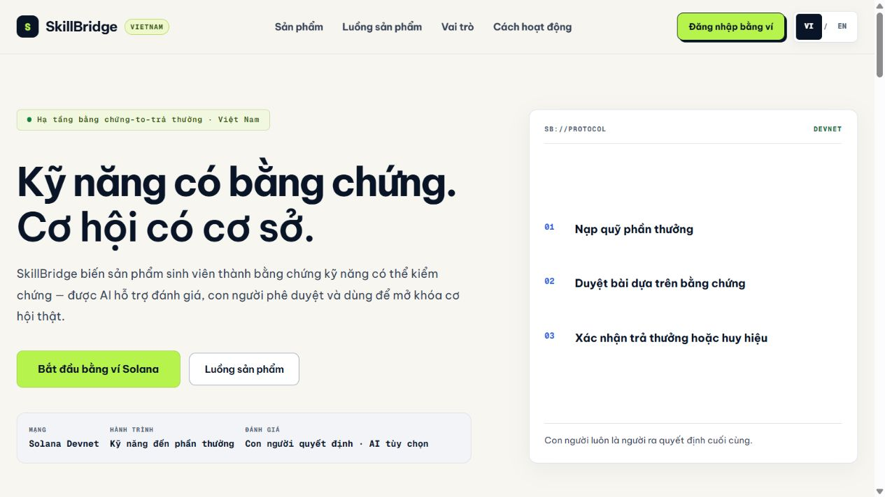
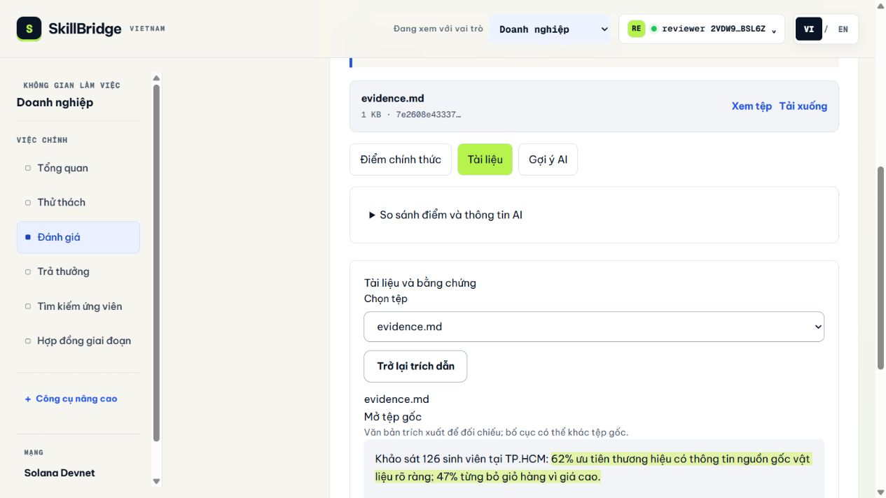
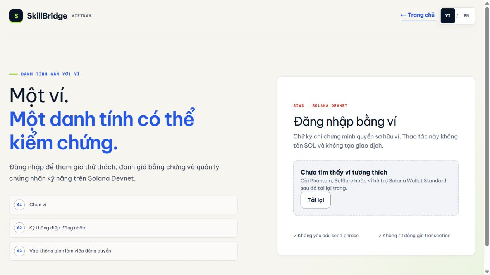
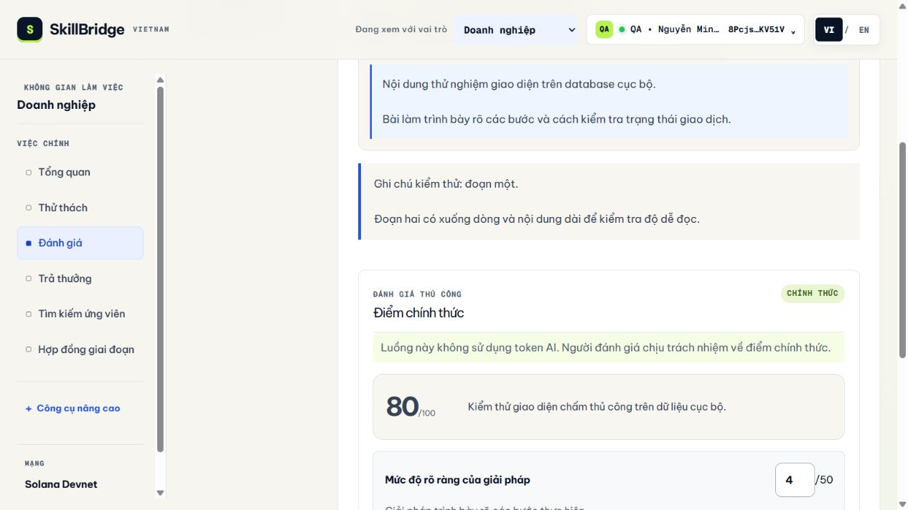

<div align="center">



# SkillBridge Vietnam

**Bài làm thành bằng chứng. Bằng chứng mở ra cơ hội.**

**Tiếng Việt** · [English](README.md)

[Trải nghiệm sản phẩm](https://404-eight-rho.vercel.app/) · [Tra cứu ví](https://404-eight-rho.vercel.app/claim-verifier/index.html) · [Dành cho giám khảo](docs/judging/README.md) · [Kiến trúc](docs/architecture/README.md)

[](https://github.com/2274802010922/404/actions/workflows/ci.yml)


</div>

SkillBridge kết nối sinh viên, doanh nghiệp và đơn vị đánh giá qua bài làm thực tế:
doanh nghiệp ký quỹ thử thách, con người đánh giá, sinh viên nhận chứng nhận kỹ năng
và phần thưởng đã được phân bổ. Chứng nhận có thể được doanh nghiệp khác chấp nhận
khi sinh viên ứng tuyển.

Dự án phục vụ **UniHackFest**, có giao diện Việt/Anh và hoạt động blockchain trên
Solana Devnet. Bằng chứng on-chain, dữ liệu kiểm thử và phần còn chờ kiểm tra thủ công
được phân biệt rõ bên dưới.

## Một hành trình xuyên suốt



## Những tính năng nổi bật

| Tính năng | Người dùng có thể làm gì |
| --- | --- |
| Thử thách có quỹ bảo đảm | Tạo đề bài rõ ràng, chọn công khai/chỉ mời, kiểm tra địa chỉ và trạng thái quỹ |
| Đánh giá có bằng chứng | Bấm trích dẫn, mở đúng tệp, xem đoạn văn bản và trang PDF; con người xác nhận điểm chính thức |
| Tiến trình bài nộp | Theo dõi bài, kết quả, phân bổ thưởng, nhận thưởng và chứng nhận tại một nơi |
| Ứng tuyển bằng chứng nhận | Chọn chứng nhận, kiểm tra điều kiện, xem trước thông tin và xác nhận gửi hồ sơ |
| Kiểm tra lại hiệu lực | Doanh nghiệp phân biệt điều kiện lúc nộp với trạng thái chứng nhận hiện tại |
| Nhận thưởng có tài trợ phí | Sinh viên ký bằng ví; ví tài trợ trả phí Devnet trong hạn mức |
| Công cụ độc lập | Tra cứu bằng địa chỉ ví, chia sẻ QR và nhận khoản đã phân bổ qua công cụ có thể host riêng |

Chấm thủ công hoạt động độc lập. AI không có quyền phê duyệt bài, phân bổ quỹ hay ký trả thưởng.

<details>
<summary><strong>Xem giao diện sản phẩm</strong></summary>



**Mở trích dẫn và đối chiếu đoạn văn bản**



Ảnh trình đọc dùng dữ liệu QA có ghi nhãn, không phải số liệu khảo sát hoặc khách hàng thật.





</details>

## Bằng chứng có thể kiểm tra

| Nội dung | Bằng chứng và phạm vi |
| --- | --- |
| Nhận thưởng không cần API SkillBridge | [Claim độc lập](docs/solana/evidence/independent-claim-proof.json): giao dịch SOL Devnet |
| Ví nhận bắt đầu với 0 SOL | [Claim có tài trợ phí](docs/solana/evidence/sponsored-claim-proof.json): nhận 0,001 SOL; ví tài trợ trả 10.000 lamport phí |
| Thu hồi làm thay đổi kết quả kiểm tra | [Chứng nhận và cơ hội](docs/solana/evidence/opportunity-application-proof.json): đạt trước thu hồi, bị từ chối sau thu hồi |
| Đánh giá → ứng tuyển và phân quyền | [Kiểm thử HTTP](tests/integration/competition-flow.test.ts) với database riêng và RPC mô phỏng có ghi rõ |
| Không ký giao dịch đã bị sửa | [Kiểm thử đồng ký](tests/solana/sponsored-claim.test.ts) |
| Gửi lặp không tạo đơn trùng | [Kiểm thử ứng tuyển](tests/backend/applications.test.ts) |

Bộ kiểm thử mặc định đã qua **116 ca** ở mốc phát hành này. CI chạy build, kiểm tra
cấu trúc repo, lint và kiểm thử tự động. Kiểm thử Devnet được chạy riêng và dùng SOL thử nghiệm.

**Còn kiểm tra thủ công:** chủ dự án sẽ kiểm tra OpenRouter thật sau khi triển khai.
Tài trợ phí SOL đã có bằng chứng live; USDC đã kiểm tra cấu trúc instruction và còn
cần một lượt live với USDC Devnet. Không tuyên bố đã sẵn sàng mainnet hoặc đã được audit.

## Vai trò của Solana

- **Ký quỹ:** chương trình giữ tiền, kiểm tra vai trò, phân bổ, đúng người nhận và
  ngăn nhận thưởng lặp.
- **Chứng nhận SAS:** có thể đọc ngoài ứng dụng, kiểm tra đơn vị cấp, người ký, hết hạn
  và thu hồi.
- **Điều kiện cơ hội:** chương trình lưu điều kiện và biên nhận lịch sử do verifier
  xác nhận. Dịch vụ verifier kiểm tra SAS mới trước khi ứng tuyển; gate hiện tại
  không tự phân tích chứng nhận SAS bên trong smart contract.
- **Nhận thưởng độc lập:** khoản đã phân bổ có thể được nhận qua công cụ riêng,
  RPC và ví tương thích.

Tệp riêng và hồ sơ ứng tuyển được lưu off-chain. Chương trình vẫn còn quyền nâng cấp.
Nếu cả hai người đánh giá không xử lý, quỹ chưa giải quyết tiếp tục chờ theo điều khoản.
Xem [ranh giới tin cậy](docs/product/proof-to-payout.md) và
[hướng dẫn escrow](docs/solana/escrow-runbook.md).

## Chạy và triển khai

Cần Node.js **22.13+** và npm. Chạy từ thư mục gốc:

```bash
npm ci
npm run dev
```

Tạo `.env.local` theo [.env.example](.env.example) trước khi kiểm tra tích hợp.
Không có cấu hình Turso thì môi trường local dùng SQLite.

Chạy riêng công cụ xác minh:

```bash
npm run preview:verifier
```

Ứng dụng ở [localhost:3000](http://localhost:3000); công cụ riêng ở
[localhost:3219](http://localhost:3219).

Deploy **một project Next.js trên Vercel**, Root Directory là gốc repo, build bằng
`npm run build`. Bản nâng cấp này không cần reset database hoặc deploy lại chương trình Solana.

- [Cấu hình Vercel](docs/deployment/vercel.md)
- [Cấu hình OpenRouter](docs/deployment/openrouter.md)
- [Test ứng tuyển, tiến trình, trích dẫn và bật tài trợ phí](docs/testing/competition-upgrades.md)
- [Hướng dẫn công cụ độc lập](docs/solana/independent-verifier.md)

```bash
npm run check:repo
npm run lint
npm test
```

## Cấu trúc repo

```text
frontend/       Giao diện, thành phần dùng chung, ngôn ngữ và CSS
backend/        HTTP, phân quyền, AI, database và lưu tệp
solana/         Anchor, IDL, chain client và ký giao dịch phía server
shared/         Quy tắc kiểm tra và kiểu dữ liệu dùng chung
app/            Khai báo route/layout Next.js
tools/          Công cụ tra cứu và nhận thưởng có thể host riêng
tests/          Unit, HTTP integration và kiểm thử Devnet tùy chọn
docs/           Sản phẩm, kiến trúc, bằng chứng và triển khai
public/         Tài nguyên công khai
tooling/        Công cụ và hướng dẫn cũ được lưu lại
```

[Frontend](frontend/README.md) · [Backend](backend/README.md) · [Solana](solana/README.md) ·
[Đóng góp](CONTRIBUTING.md) · [Changelog](CHANGELOG.md) · [Toàn bộ tài liệu](docs/README.md)

## Phạm vi và quyền sử dụng

Invoice và đổi USDC → VND là phần thử nghiệm hỗ trợ; bước chi trả VND vẫn là **sandbox**.

Repo hiện chưa cấp giấy phép mã nguồn mở. Tài nguyên thương hiệu giữ quyền sở hữu
tương ứng; xem [nguồn tài nguyên](public/brands/README.md). Không commit file môi trường
hoặc khóa ví vào Git.
