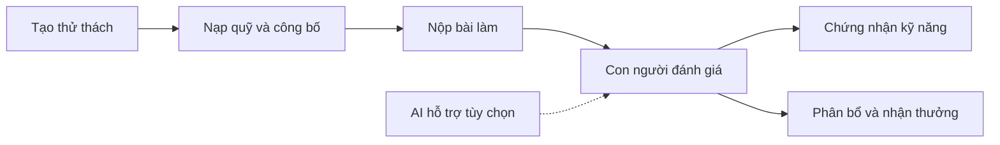

<div align="center">
  

# SkillBridge Vietnam

### Kỹ năng có bằng chứng. Cơ hội có cơ sở.

Kết nối sinh viên, doanh nghiệp và đơn vị đánh giá thông qua bài làm thực tế, đánh giá của con người và bằng chứng trên Solana Devnet.

**Tiếng Việt** · [English](README.md)

[Trải nghiệm sản phẩm](https://404-eight-rho.vercel.app/) · [Dành cho giám khảo](docs/judging/README.md) · [Kiến trúc](docs/architecture/README.md) · [Bằng chứng Devnet](docs/solana/README.md)

[](https://github.com/2274802010922/404/actions/workflows/ci.yml)

</div>

---


<details>
<summary>Xem thêm giao diện sản phẩm</summary>

**Đăng nhập bằng ví** — ảnh chụp trong trình duyệt chưa cài tiện ích ví.


**Chấm thủ công** — dữ liệu QA cục bộ, không phải số liệu người dùng thực.


</details>

## SkillBridge giải quyết điều gì?

Sinh viên cần chứng minh năng lực bằng bài làm. Doanh nghiệp cần căn cứ để đánh giá
ứng viên. Đơn vị đánh giá cần quy trình chấm bài và xác nhận thành tích rõ ràng.

SkillBridge kết nối các bước này: tạo thử thách, bảo đảm phần thưởng, nhận bài,
đánh giá và phát hành chứng nhận hoặc trao thưởng có thể kiểm tra.

## Luồng sản phẩm



- **Sinh viên:** khám phá thử thách, nộp bài, tạo hồ sơ riêng cho ví và chia sẻ thành tích.
- **Doanh nghiệp:** công bố đề bài, bảo đảm ngân sách thưởng, đánh giá và tìm ứng viên.
- **Đơn vị đánh giá:** chấm thủ công hoặc tham khảo AI; con người quyết định điểm chính thức.
- **Người kiểm tra:** xem trạng thái chứng nhận và bằng chứng giao dịch.

## Phạm vi đang có

| Phần | Hiện trạng |
| --- | --- |
| Đăng nhập | Ví Solana, phiên đăng nhập và phân quyền phía server |
| Thử thách | Công khai hoặc chỉ mời; chỉnh sửa bản nháp; đề bài có bố cục; nộp tệp |
| Đánh giá | Chấm thủ công độc lập; AI tùy chọn với trích xuất tài liệu và cache |
| Chứng nhận | Cấp, thu hồi và xác minh trên Solana Devnet |
| Thưởng thử thách mới bằng tiền | Smart contract ký quỹ; con người quyết định người nhận, người nhận ký nhận thưởng |
| Quỹ cũ và ký quỹ huy hiệu | Giữ luồng Reward Vault cũ, không tự chuyển đổi bản ghi |
| Yêu cầu thanh toán USDC | Chuyển ví trên Devnet và đối soát bằng mã giao dịch |
| USDC → VND | Chuyển Devnet và đối soát VND **sandbox**, chưa phải trả tiền ngân hàng thật |

[Runbook ký quỹ](docs/solana/escrow-runbook.md) giải thích thời hạn, người đánh giá
dự phòng, hoàn quỹ, quyền nâng cấp và giới hạn của từng luồng.

## Cấu trúc mã nguồn

```text
frontend/     Giao diện, thành phần dùng chung, ngôn ngữ và CSS
backend/      Xử lý API, xác thực, AI, lưu tệp và database
solana/       Smart contract Anchor, IDL và tích hợp blockchain
shared/       Quy tắc kiểm tra và dữ liệu thuần dùng chung
app/          Khai báo URL và layout Next.js
tests/        Kiểm thử backend, Solana và tích hợp
docs/         Tài liệu sản phẩm, triển khai và dự thi
public/       Tài nguyên công khai của ứng dụng
tooling/      Công cụ Sites cũ và hướng dẫn agent được lưu lại
```

[Frontend](frontend/README.md) · [Backend](backend/README.md) · [Solana](solana/README.md)

Frontend và backend vẫn chạy chung trên **một project Vercel**. URL của sản phẩm
không thay đổi theo cách tổ chức thư mục.

## Chạy dự án

Cần Node.js **22.13 trở lên** và npm. Chạy từ thư mục gốc:

```bash
npm ci
```

Sao chép `.env.example` thành `.env.local`, cấu hình các tính năng cần dùng:

```bash
npm run dev
```

Truy cập [localhost:3000](http://localhost:3000). Khi không cấu hình Turso, môi trường
local dùng SQLite. AI, lưu tệp và giao dịch blockchain cần cấu hình tương ứng.

## Kiểm tra chất lượng

```bash
npm run check:repo
npm run lint
npm test
```

Các kiểm thử Devnet và local validator có lệnh riêng trong [hướng dẫn kiểm thử](docs/testing/README.md).

## Đường dẫn hữu ích

- [Hướng dẫn cho giám khảo](docs/judging/README.md)
- [Kiến trúc và ranh giới mã nguồn](docs/architecture/README.md)
- [Deploy Vercel và cấu hình môi trường](docs/deployment/vercel.md)
- [Test thủ công theo vai trò](docs/testing/manual-test-guide.md)
- [Bằng chứng Solana Devnet](docs/solana/README.md)
- [Toàn bộ tài liệu](docs/README.md)
- [Quy trình đóng góp](CONTRIBUTING.md) · [Lịch sử thay đổi](CHANGELOG.md)

Dự án phục vụ UniHackFest, hoạt động blockchain trên Devnet. Repo hiện chưa cấp
giấy phép mã nguồn mở. Xem [nguồn tài nguyên thương hiệu](public/brands/README.md).
