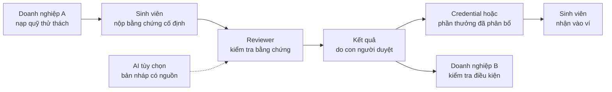
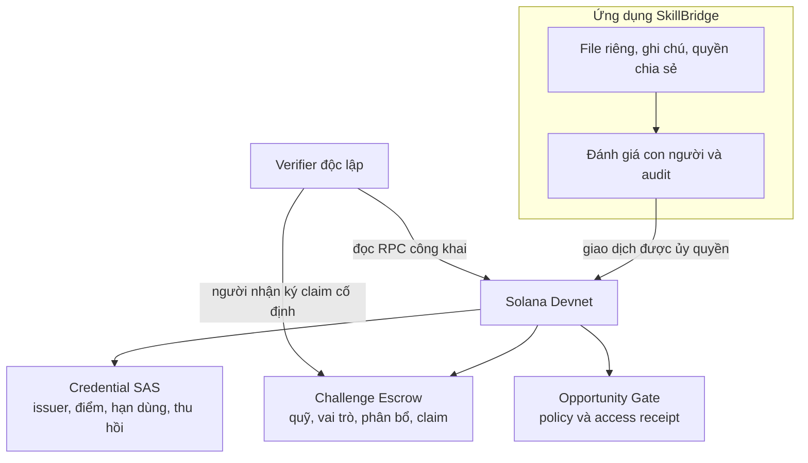
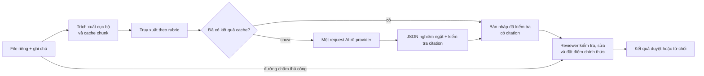
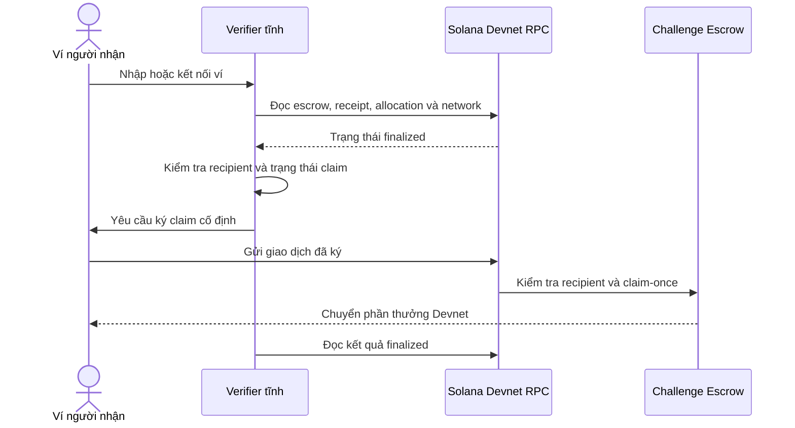
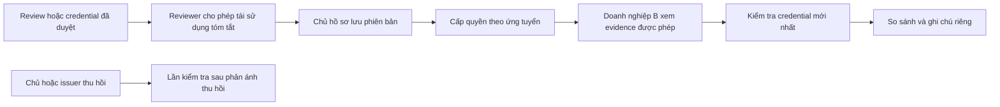
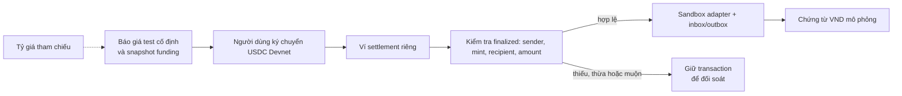

<div align="center">


# SkillBridge Vietnam

**Bài làm thành bằng chứng. Bằng chứng mở ra cơ hội.**

**Tiếng Việt** · [English](README.md)

[Mở demo](https://404-eight-rho.vercel.app/) · [Tra cứu ví độc lập](https://404-eight-rho.vercel.app/claim-verifier/index.html) · [Hướng dẫn cho giám khảo](docs/judging/README.md) · [Kiến trúc](docs/architecture/README.md) · [Nghiệm thu demo](docs/testing/demo-reliability-acceptance.md)

[](https://github.com/2274802010922/SkillBridge-Vietnam/actions/workflows/ci.yml)

> Bản sửa reliability (21/09): hiển thị đúng quyền reviewer và tiến trình thưởng, phục hồi issuer, chống dùng lại giao dịch milestone. Build và 184 test local đạt; nghiệm thu ví/provider thật theo [runbook](docs/testing/demo-reliability-acceptance.md).


</div>

> **Phạm vi demo:** Solana Devnet · AI tùy chọn · con người quyết định chính thức · đổi VND chỉ là sandbox.

SkillBridge biến bài làm thật của sinh viên hoặc freelancer thành bằng chứng được con người đánh giá, có thể phát hành thành chứng nhận kiểm chứng được và tái sử dụng khi ứng tuyển cơ hội tiếp theo.

Cam kết cốt lõi: **doanh nghiệp tạo thử thách và ký quỹ, người tham gia nộp một phiên bản cố định, người đánh giá chịu trách nhiệm cho quyết định, còn người nộp mang bằng chứng đó đến tổ chức khác.**

## Sản phẩm trong một phút

| Người dùng | Vấn đề | SkillBridge cung cấp |
| --- | --- | --- |
| Sinh viên / freelancer | Bài làm nằm trong file và khó so sánh công bằng | Bằng chứng riêng tư, kết quả do người duyệt, Skill Passport và đường nhận thưởng độc lập |
| Doanh nghiệp | Hồ sơ có nhiều lời khẳng định nhưng ít tín hiệu được kiểm tra | Thử thách có quỹ, rubric chung, bằng chứng quỹ và cơ hội yêu cầu credential |
| Nhà trường / reviewer | Kết quả đánh giá khó tái sử dụng và khó audit | Evidence reader, AI tùy chọn, chấm thủ công, provenance và credential có thể thu hồi |



## Showcase giao diện

Ảnh được chụp từ bản build hiện tại. Các ảnh workflow dùng fixture QA có ghi nhãn; chúng minh họa giao diện và phân quyền, không phải traction hay doanh thu.

| Trang giới thiệu | Kết nối ví |
| --- | --- |
|  |  |
| Hiểu thesis sản phẩm và phạm vi demo. | Kết nối ví Solana; chưa cần nạp tiền để bắt đầu. |

| Chi tiết thử thách | Bài nộp sinh viên |
| --- | --- |
|  |  |
| Đọc đề bài, rubric, phần thưởng và bằng chứng quỹ. | Nộp file, ghi chú và phiên bản evidence cố định. |

| Đánh giá bởi con người | Skill Passport |
| --- | --- |
|  |  |
| AI có thể gợi ý; reviewer sửa và chịu trách nhiệm cho điểm chính thức. | Kiểm tra credential đang hoạt động, có thể thu hồi và gắn với ví. |


Evidence reader dùng dữ liệu QA có ghi nhãn và cho reviewer mở nguồn phía sau một citation.

| Hồ sơ sinh viên | So sánh ứng viên |
| --- | --- |
|  |  |
| Chọn bằng chứng và lưu một phiên bản theo mục tiêu. | So sánh bằng chứng được cấp quyền và lưu ghi chú riêng. |

| Sandbox đổi USDC Devnet |
| --- |
|  |
| Giao dịch USDC Devnet được kiểm tra thật; chứng từ VND được mô phỏng rõ ràng. |

## Vì sao cần blockchain

Solana giữ các sự kiện cần kiểm tra độc lập: quyền giữ quỹ, vai trò đã chấp nhận, phân bổ phần thưởng, người nhận cố định, chống claim lặp, trạng thái credential và biên nhận truy cập. File riêng, ghi chú và dữ liệu cá nhân vẫn ở ngoài chuỗi.



Smart contract không chứng minh điểm số của con người là công bằng hoặc issuer đáng tin. Nó làm cho quyền sở hữu và trạng thái đã cam kết có thể kiểm tra; verifier vẫn áp dụng policy về issuer, ví, điểm và hiệu lực.

## AI hỗ trợ, con người quyết định



Luồng đánh giá trích xuất tài liệu cục bộ, lấy đúng bằng chứng theo rubric, cache chunk và kết quả theo hash, rồi chỉ gọi AI một lần cho mỗi phiên bản bài nộp. AI không phê duyệt, phân bổ thưởng, phát hành credential hay ký giao dịch. Chấm thủ công vẫn hoạt động độc lập.

## Nhận thưởng không phụ thuộc API ứng dụng

Khoản thưởng đã phân bổ có thể được kiểm tra và nhận qua verifier tĩnh. Công cụ đọc trạng thái Devnet bằng RPC công khai, kiểm tra người nhận và allocation rồi yêu cầu ví người nhận ký claim cố định.



## Hồ sơ bằng chứng và doanh nghiệp B



Chủ hồ sơ chọn dữ liệu để chia sẻ. File bài nộp gốc và ghi chú reviewer không tự động được mở cho doanh nghiệp. Kiểm tra credential ở hiện tại được tách khỏi quyết định lịch sử lúc ứng tuyển.

## Ranh giới sandbox off-ramp



Cashout là thí nghiệm riêng với escrow challenge. Lệnh mới dùng ví settlement Devnet riêng, snapshot bất biến và giữ giao dịch chưa rõ kết quả. Không tuyên bố chuyển khoản ngân hàng hoặc VND thật.

## Giả thuyết mô hình kinh doanh

Wedge đầu tiên là pilot tại Việt Nam với trường, câu lạc bộ hoặc doanh nghiệp chạy một số thử thách nhỏ. Giá trị có thể thu phí nằm ở vận hành: tạo challenge, quy trình reviewer, phát hành credential, kiểm tra ứng viên và chia sẻ hồ sơ. Repo chứng minh sản phẩm và giới hạn sử dụng; chưa tuyên bố có khách hàng trả tiền hoặc doanh thu.

## Bằng chứng có thể kiểm tra

| Nội dung | Bằng chứng |
| --- | --- |
| Nhận thưởng không cần API SkillBridge | [Bằng chứng claim độc lập](docs/solana/evidence/independent-claim-proof.json) |
| Ví nhận bắt đầu với 0 SOL | [Bằng chứng tài trợ phí](docs/solana/evidence/sponsored-claim-proof.json) |
| Thu hồi làm thay đổi eligibility mới | [Bằng chứng opportunity](docs/solana/evidence/opportunity-application-proof.json) |
| Phân quyền review, portfolio và doanh nghiệp | [Competition flow](tests/integration/competition-flow.test.ts) và [portfolio flow](tests/integration/portfolio-flow.test.ts) |
| Cấp credential chịu được lỗi DB/RPC | [Issuance fault tests](tests/backend/credential-issuance.test.ts) |
| Cashout recovery và chống webhook replay | [Off-ramp tests](tests/backend/offramp.test.ts) và [hướng dẫn](docs/testing/offramp.md) |

Bộ test chuẩn hiện có **168 ca** pass ở local. Live Devnet và live OpenRouter là bước nghiệm thu riêng. Dự án không tuyên bố mainnet-ready hoặc đã được security audit.

## Luồng demo

1. Mở demo và kết nối ví Devnet.
2. Vào role doanh nghiệp, mở challenge có quỹ và chỉ ra trạng thái quỹ.
3. Chuyển sang sinh viên, nộp file evidence có nhãn và mở tiến trình.
4. Chuyển sang reviewer. Mở evidence reader, AI suggestion tùy chọn và điểm thủ công chính thức.
5. Mở Skill Passport và link xác minh công khai.
6. Dùng verifier độc lập để giải thích claim đã phân bổ có thể rời khỏi API ứng dụng.
7. Kết thúc bằng màn hình so sánh ứng viên và scope Devnet/sandbox.

Xem checklist giám khảo tại [docs/judging/README.md](docs/judging/README.md) và checklist role tại [docs/testing/manual-test-guide.md](docs/testing/manual-test-guide.md).

## Chạy và triển khai

Cần Node.js **22.13+** và npm.

```bash
npm ci
npm run dev
```

Tạo `.env.local` theo [.env.example](.env.example). Local dùng SQLite nếu chưa cấu hình Turso.

```bash
npm run check:repo
npm run lint
npm test
```

Deploy một project Next.js trên Vercel từ thư mục gốc repo. Xem [Vercel](docs/deployment/vercel.md), [OpenRouter](docs/deployment/openrouter.md) và [off-ramp sandbox](docs/testing/offramp.md). Không commit `.env.local`, keypair hoặc secret provider.

## Cấu trúc repo

```text
app/            Adapter route và layout Next.js
frontend/       Màn hình React, component, copy song ngữ và CSS
backend/        HTTP, auth, AI, database, storage và services
solana/         Anchor, IDL, chain client và kiểm tra phía server
shared/         Validation và data contract thuần
tools/          Verifier ví có thể host riêng
tests/          Unit, HTTP integration, browser fixture và Devnet tùy chọn
docs/           Sản phẩm, kiến trúc, bằng chứng, triển khai và harness
public/         Tài nguyên công khai
```

[Frontend](frontend/README.md) · [Backend](backend/README.md) · [Solana](solana/README.md) · [Kiến trúc](docs/architecture/README.md) · [Toàn bộ tài liệu](docs/README.md) · [Changelog](CHANGELOG.md)

Invoice và đổi USDC → VND là thí nghiệm hỗ trợ; bước VND vẫn là **sandbox**. Repo hiện chưa cấp giấy phép mã nguồn mở.
