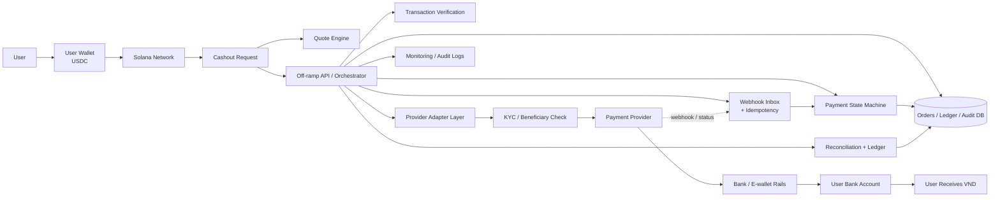
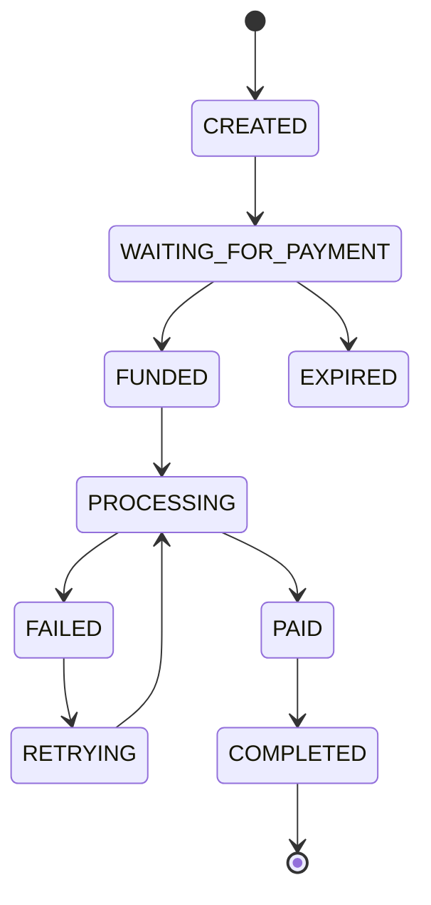
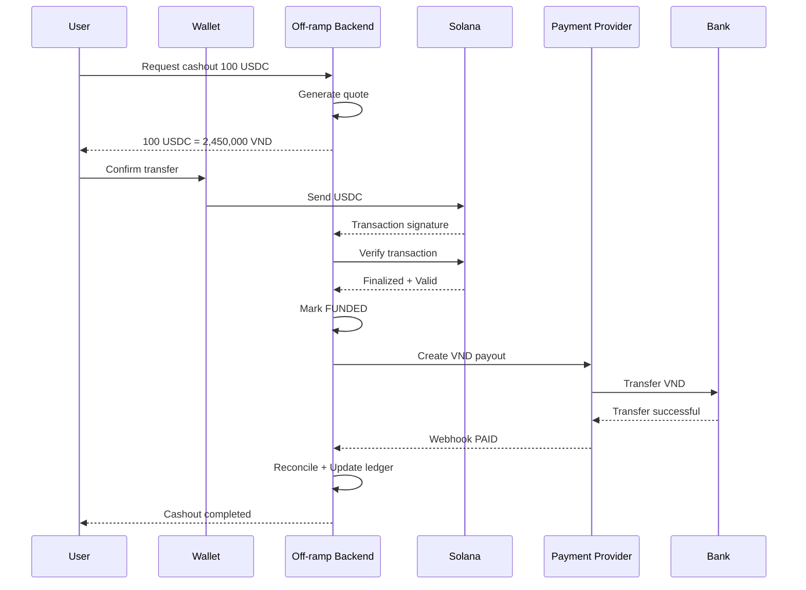

# Crypto-to-VND Off-ramp Architecture

## 1. Mục tiêu sản phẩm

Xây dựng một hệ thống **Crypto-to-VND Off-ramp** cho phép người dùng:

> **Nhận USDC → tạo yêu cầu cashout → xác minh giao dịch on-chain → xử lý payout qua payment provider → nhận VND vào tài khoản ngân hàng / ví điện tử.**

Mục tiêu chính là **ẩn bớt sự phức tạp của blockchain** và biến việc nhận crypto thành một trải nghiệm thanh toán gần giống các ứng dụng tài chính thông thường.

---

## 2. Kiến trúc tổng thể



---

## 3. Luồng hoạt động chi tiết

### Bước 1 — User có USDC

Người dùng đang sở hữu USDC trong ví blockchain.

Ví dụ:

- Phantom
- Solflare
- Ví embedded trong ứng dụng
- Smart wallet

---

### Bước 2 — User tạo yêu cầu cashout

Người dùng nhập:

- Số lượng USDC muốn đổi
- Thông tin tài khoản nhận VND
- Ngân hàng / ví điện tử
- Thông tin beneficiary nếu cần

Hệ thống tạo một `Cashout Order`.

Ví dụ:

```text
Cashout Order
-------------------------
Amount:       100 USDC
Rate:         25,000 VND
Fee:          50,000 VND
Receive:      2,450,000 VND
Status:       WAITING_FOR_PAYMENT
```

---

### Bước 3 — Quote Engine tính tỷ giá

`Quote Engine` chịu trách nhiệm:

- Lấy tỷ giá USDC/VND
- Tính phí
- Tính số VND người dùng nhận
- Giới hạn thời gian hiệu lực của quote

Ví dụ:

```text
100 USDC
   ↓
Exchange Rate
   ↓
2,500,000 VND
   ↓
Platform / Provider Fee
   ↓
2,450,000 VND
```

Quote nên được lưu thành **snapshot** tại thời điểm user xác nhận giao dịch.

---

## 4. On-chain Transaction Verification

Sau khi user gửi USDC, backend không nên tin dữ liệu do frontend gửi lên.

Backend phải tự xác minh transaction trên blockchain.

```text
User Wallet
     ↓
Send USDC
     ↓
Solana
     ↓
Transaction Signature
     ↓
Backend Verification
```

### Các thông tin cần kiểm tra

- Transaction có tồn tại hay không
- Transaction đã finalized chưa
- Đúng network hay không
- Đúng token mint USDC hay không
- Đúng sender wallet
- Đúng destination wallet
- Đúng amount
- Transaction chưa được sử dụng cho order khác

Pseudo flow:

```text
verifyTransaction(signature)
        ↓
Check transaction exists
        ↓
Check token = USDC
        ↓
Check amount
        ↓
Check sender
        ↓
Check destination
        ↓
Check finality
        ↓
Mark order as FUNDED
```

Đây là một trong những **điểm mạnh kỹ thuật quan trọng nhất của team** vì hệ thống không chỉ dựa vào frontend để xác nhận thanh toán.

---

# 5. Off-ramp API / Orchestrator

Đây là **core của toàn bộ hệ thống**.

```text
                ┌─────────────────────────┐
                │ Off-ramp Orchestrator   │
                └────────────┬────────────┘
                             │
         ┌───────────────────┼───────────────────┐
         ↓                   ↓                   ↓
 Transaction Verify    Payment Provider     Payment State
         ↓                   ↓                   ↓
 Reconciliation          Webhook            Database
```

Orchestrator chịu trách nhiệm:

1. Tạo cashout order
2. Tạo quote
3. Theo dõi USDC deposit
4. Verify transaction
5. Update payment state
6. Gọi payment provider
7. Nhận webhook
8. Reconcile giao dịch
9. Xác nhận payout hoàn tất

---

# 6. Payment State Machine

Payment không nên chỉ có:

```text
SUCCESS
FAILED
```

Nên sử dụng một **state machine** rõ ràng.

Ví dụ:



Ví dụ các trạng thái:

```text
CREATED
↓
WAITING_FOR_PAYMENT
↓
FUNDED
↓
PROCESSING
↓
PAID
↓
COMPLETED
```

Hoặc khi lỗi:

```text
PROCESSING
↓
FAILED
↓
RETRYING
↓
PROCESSING
```

---

# 7. Provider Adapter Layer

Không nên hard-code hệ thống vào một payment provider duy nhất.

Thay vào đó:

```text
                 Off-ramp Core
                       │
                       ↓
               Provider Adapter
                       │
        ┌──────────────┼──────────────┐
        ↓              ↓              ↓
     Provider A     Provider B     Provider C
```

Ví dụ interface:

```ts
interface PaymentProvider {

    createPayout(order): Promise<Payout>

    getPayoutStatus(id): Promise<Status>

    cancelPayout(id): Promise<void>

}
```

Điều này cho phép thay đổi provider mà không cần sửa toàn bộ hệ thống.

Đây cũng là một điểm mạnh về **khả năng mở rộng kiến trúc**.

---

# 8. KYC / Beneficiary Verification

Trước khi payout VND, hệ thống có thể cần kiểm tra:

```text
User
 ↓
Beneficiary Info
 ↓
KYC / Verification
 ↓
Payment Provider
```

Các thông tin có thể gồm:

- Họ tên
- Số tài khoản
- Ngân hàng
- Số điện thoại
- Thông tin KYC
- Beneficiary ownership

Trong MVP có thể sử dụng:

```text
Mock / Sandbox KYC
```

Sau đó thay bằng provider thật.

---

# 9. Fiat / VND Payout

Sau khi USDC được verify:

```text
USDC Verified
      ↓
Off-ramp Backend
      ↓
Payment Provider
      ↓
Bank / E-wallet Network
      ↓
User Bank Account
      ↓
VND
```

Các payment rails có thể là:

```text
Bank transfer
QR payment
E-wallet
Payment gateway
```

---

# 10. Webhook Processing

Payment provider thường xử lý payout bất đồng bộ.

Ví dụ:

```text
Backend
   ↓
Create payout
   ↓
Provider
   ↓
PROCESSING
```

Sau một khoảng thời gian:

```text
Provider
   ↓
Webhook
   ↓
Backend
   ↓
PAID
```

---

## Webhook Inbox

Webhook nên được đưa qua một inbox:

```text
Provider
    ↓
Webhook
    ↓
Webhook Inbox
    ↓
Validate
    ↓
Deduplicate
    ↓
Process
    ↓
Update Order
```

---

# 11. Idempotency

Payment API cần chống việc xử lý một request nhiều lần.

Ví dụ user bấm:

```text
Withdraw
Withdraw
Withdraw
```

Hệ thống vẫn chỉ tạo:

```text
1 payout
```

Có thể sử dụng:

```text
Idempotency-Key
```

Ví dụ:

```http
POST /cashouts

Idempotency-Key: cashout-user123-001
```

Backend kiểm tra:

```text
Key đã tồn tại?
      │
   YES│        NO
      ↓         ↓
Return old   Create order
response
```

---

# 12. Reconciliation

Đây là một trong những phần giúp hệ thống khác với một **crypto transfer demo**.

Payment thực tế có thể xảy ra nhiều trường hợp.

---

## Underpayment

User cần gửi:

```text
100 USDC
```

nhưng chỉ gửi:

```text
99 USDC
```

Hệ thống cần phát hiện:

```text
UNDERPAID
```

---

## Overpayment

User cần gửi:

```text
100 USDC
```

nhưng gửi:

```text
110 USDC
```

Hệ thống cần xác định:

```text
10 USDC dư xử lý như thế nào?
```

---

## Late Payment

Quote hết hạn:

```text
Quote valid: 10 minutes
```

nhưng user gửi tiền sau:

```text
15 minutes
```

Hệ thống cần xử lý:

```text
LATE_PAYMENT
```

thay vì tự động payout.

---

# 13. Ledger

Ngoài `Order Database`, nên có internal ledger.

Ví dụ:

```text
Order #123

Crypto In
+100 USDC

Fee
-2 USDC

Provider Settlement
-98 USDC

Fiat Payout
+2,450,000 VND
```

Ledger giúp:

- Audit
- Reconciliation
- Debug
- Financial reporting
- Điều tra lỗi

---

# 14. Monitoring & Audit Logs

Payment system phải trace được toàn bộ lifecycle.

Ví dụ:

```text
10:01 Order created
10:02 Quote accepted
10:03 USDC transaction detected
10:04 Blockchain finalized
10:04 Payment verified
10:05 Payout requested
10:06 Provider processing
10:07 Provider webhook received
10:07 VND paid
10:07 Order completed
```

---

# 15. Luồng End-to-End hoàn chỉnh



---

# 16. Điểm mạnh kỹ thuật của team

Nếu trình bày với mentor, nên nhấn mạnh rằng team không chỉ làm:

```text
Wallet A → Wallet B
```

mà đang xây dựng:

```text
Crypto
  ↓
Transaction Verification
  ↓
Payment Orchestration
  ↓
Provider Integration
  ↓
Fiat Settlement
  ↓
Reconciliation
  ↓
VND
```

## Các điểm mạnh chính

### 1. Đã có kinh nghiệm xử lý USDC trên Solana

Team đã hiểu:

- Wallet
- Token transfer
- Transaction signature
- Confirmation
- Finality

---

### 2. Có transaction verification

Backend tự xác minh:

```text
wallet
token
amount
destination
transaction
finality
```

thay vì tin dữ liệu frontend.

---

### 3. Có payment state machine

Team hiểu payment là một lifecycle:

```text
Created
↓
Funded
↓
Processing
↓
Paid
↓
Completed
```

---

### 4. Có webhook + idempotency

Team đã nghĩ đến:

```text
duplicate request
duplicate webhook
retry
network failure
```

Đây là các vấn đề rất thường gặp trong payment system.

---

### 5. Có reconciliation

Hệ thống có thể xử lý:

```text
underpayment
overpayment
late payment
duplicate payment
```

Đây là điểm khác biệt lớn giữa:

```text
crypto demo
```

và:

```text
payment infrastructure
```

---

### 6. Kiến trúc provider-agnostic

Core payment không phụ thuộc một provider duy nhất.

```text
Core
 ↓
Adapter
 ↓
Provider A / B / C
```

Cho phép mở rộng hoặc thay provider dễ dàng.

---

# 17. Phần team cần phát triển tiếp

Hiện tại có thể tập trung vào:

```text
Real Payment Provider
        ↓
KYC
        ↓
Beneficiary Verification
        ↓
Real Settlement
        ↓
VND Payout
        ↓
Production Monitoring
```

---

# 18. MVP đề xuất

Không cần xây toàn bộ hệ thống tài chính ngay lập tức.

MVP có thể giới hạn:

```text
USDC
 ↓
Solana
 ↓
Transaction Verification
 ↓
Cashout API
 ↓
Payment Provider Sandbox
 ↓
VND Sandbox Payout
```

Sau đó mới mở rộng:

```text
Real Provider
↓
Real VND
↓
KYC
↓
Multiple Providers
↓
Multiple Stablecoins
↓
Multiple Blockchain Networks
```

---

# 19. Product Vision

Tầm nhìn dài hạn:

```text
Any App
   ↓
Off-ramp API
   ↓
Crypto
   ↓
Local Currency
   ↓
Bank / E-wallet
```

Developer chỉ cần gọi:

```http
POST /cashouts
```

với dữ liệu:

```json
{
  "asset": "USDC",
  "network": "solana",
  "amount": 100,
  "currency": "VND",
  "bankAccount": "..."
}
```

Phần còn lại được hệ thống xử lý:

```text
Quote
Transaction verification
Blockchain confirmation
Provider routing
Payout
Webhook
Reconciliation
Ledger
Monitoring
```

---

# 20. Một câu để pitch với mentor

> **Bọn em không muốn xây một ứng dụng đơn thuần để chuyển USDC sang VND. Bọn em muốn xây payment infrastructure đứng giữa blockchain và hệ thống thanh toán truyền thống, chịu trách nhiệm verify giao dịch, quản lý payment lifecycle, kết nối provider, xử lý payout và reconciliation để developer có thể tích hợp Crypto-to-VND bằng một API đơn giản.**

---

## Core Value

> **Turn crypto payment into a simple local VND payout experience.**

```text
Crypto complexity
        ↓
Our Payment Infrastructure
        ↓
Simple VND experience
```
