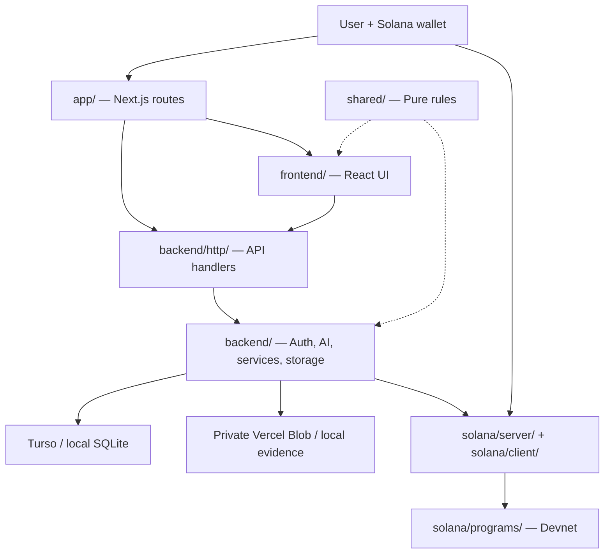

# Architecture

SkillBridge uses one Next.js application deployed on Vercel. The folders express
responsibility; they are not independently deployed services.

## Boundaries

- UI uses API URLs; it does not import server secrets or database adapters.
- Backend validates sessions and permissions for each protected operation.
- Shared validation has no server/runtime dependencies.
- Type-only frontend imports of backend/chain domain types are erased at build time.
- Route handler files retain Next.js configuration as literal exports.
- Source CSS ordering is unchanged; moving files does not change visual precedence.

## Repository map

[Frontend](../../frontend/README.md) · [Backend](../../backend/README.md) ·
[Solana](../../solana/README.md) · [Shared](../../shared/README.md)

## Persistence

Sandbox cashout uses [pinned adapters and recoverable journals](offramp.md),
separate from reward escrow and from any future real-money provider integration.

Runtime schema initialization and the migration history both remain present.
The migration directory is now `backend/database/migrations/`; SQL names,
snapshots and journal identifiers are preserved.

## Compatibility tooling

The primary build is `next build`. Old Sites/Vinext support is isolated in
[tooling/legacy-sites/](../../tooling/legacy-sites/README.md). It is retained for
reference, not presented as a second verified production deployment.
