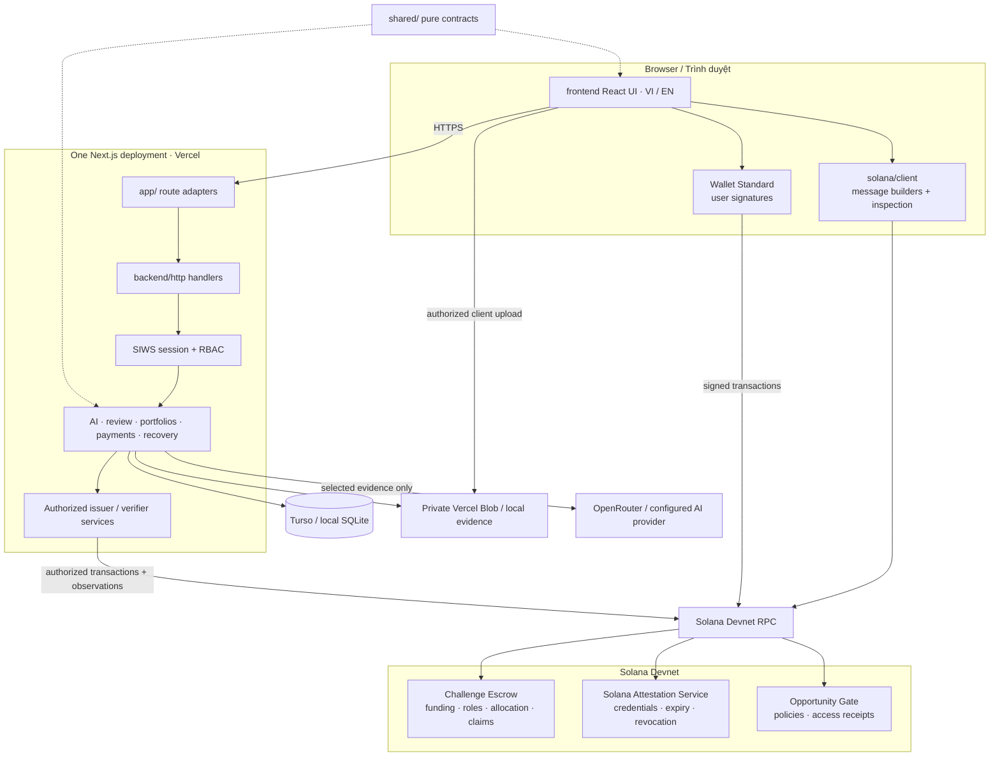
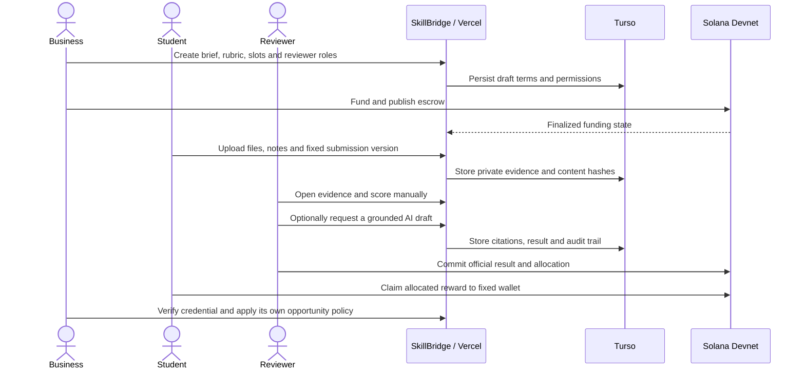
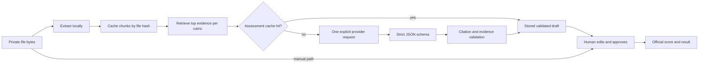
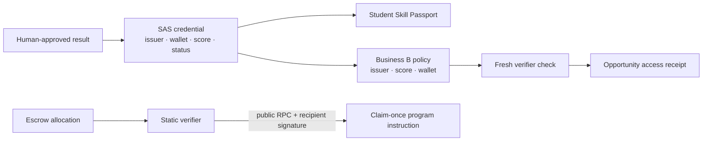

# Architecture

SkillBridge is one Next.js application deployed on Vercel. The folders describe responsibility; they are not separately deployed services.

## System map



## Product proof flow



## AI and human review



AI receives selected evidence text, not an unrestricted database or private application profile. Provider and model are recorded with the result. A valid AI response remains a proposal until the reviewer acts.

## Credential, opportunity and independent claim



The independent verifier can read the public state and submit an already allocated claim without calling SkillBridge API routes. The backend remains involved in the earlier submission registration, review and authorized issuance steps.

## Recovery and idempotency

```mermaid
sequenceDiagram
    participant Request as Authenticated request
    participant Journal as DB operation journal
    participant RPC as Solana RPC
    Request->>Journal: Reserve operation and freeze payload
    Request->>Journal: Persist signed bytes / idempotency key
    Request->>RPC: Broadcast persisted transaction
    RPC--xRequest: Timeout or response lost
    Request->>Journal: Resume same operation
    Request->>RPC: Inspect signature and finalized accounts
    alt Matching finalized state
      Request->>Journal: Commit state, event and audit atomically
    else Pending or unavailable
      Request->>Journal: Retain recoverable state
    else Mismatch
      Request->>Journal: Mark review state; never resend blindly
    end
```

Credential issuance and off-ramp payout use durable operation/inbox journals with idempotency keys and fenced leases. A lost response is reconciled using the same operation; it does not create a second transaction or payout.

## Data boundaries

| Data | System of record | Visibility |
| --- | --- | --- |
| Submission files and notes | Private Blob/local evidence storage | Owner and explicitly authorized reviewers |
| Workflow, permissions and audit | Turso/libSQL | Server-authorized users |
| Evidence hashes and result snapshots | Database plus signed/on-chain commitments | Verifiable according to product policy |
| Credential, allocation and access receipt | Solana Devnet | Public chain state with minimum disclosure |
| AI draft provenance | Database assessment record | Reviewer and authorized audit views |
| VND cashout receipt | Sandbox adapter journal | Test state; not a bank settlement |

## Module boundaries

- `app/` stays thin and exports supported Next.js route/page adapters.
- `frontend/` contains React UI, i18n, styles and Wallet Standard interactions.
- `backend/http/` authenticates requests and preserves API response contracts.
- `backend/services/` owns orchestration, audit, AI, portfolios, cashout and recovery.
- `backend/database/` contains Drizzle definitions, runtime schema, migrations and the libSQL adapter.
- `solana/client/` builds and inspects client messages; `solana/server/` verifies chain observations and authorized server actions.
- `solana/programs/` contains the deployed Devnet programs and checked-in IDL.
- `shared/` contains pure validation and data contracts without server runtime dependencies.

## Trust boundaries and known limitations

- Wallet connection authenticates ownership through SIWS; it does not grant organization permissions by itself.
- Only finalized chain observations synchronize money, credential or access state.
- AI never approves work or signs money movement.
- Private evidence is never treated as an on-chain backup; hashes are commitments.
- The escrow program remains upgradeable and is not presented as an audited mainnet custody system.
- New cashout orders use a dedicated settlement address; the VND leg remains sandbox-only.

[Proof-to-payout contract](../product/proof-to-payout.md) · [Off-ramp architecture](offramp.md) · [Solana rules](../../solana/AGENTS.md) · [Judge walkthrough](../judging/README.md)
